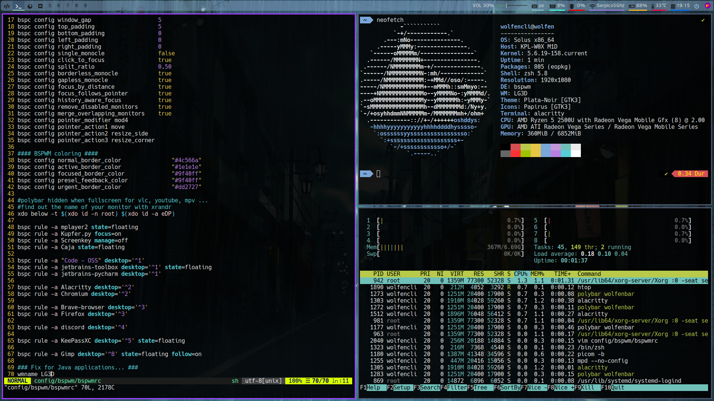

# bspwm-dotfiles

### Additional Dependencies
* sxhkd
* compton/picom
* nitrogen
* polybar
* rofi
* xbacklight
* mpd
* xkeyboard
* i3lock
* font-awesome-ttf
* flameshot
* wmname

### Instructions on Solus
```
sudo eopkg install bspwm picom nitrogen polybar xbacklight mpd xkeyboard-config i3lock font-awesome-ttf flameshot
```

We also have to install wmname to fix Java applications:
```
sudo eopkg install libx11-devel
git clone https://git.suckless.org/wmname
cd wmname
sudo make clean install
rm -rf wmname 
```

You can either copy the files or link them:
```sh
ln -s $PWD/config/bspwm ~/.config/
ln -s $PWD/config/alacritty ~/.config/
ln -s $PWD/config/polybar ~/.config/
ln -s $PWD/config/rofi ~/.config/
ln -s $PWD/config/sxhkd ~/.config/
ln -s $PWD/.vimrc ~/
```

### Getting touchpad to work properly
This assumes that you have synaptics installed  
Edit `/etc/X11/xorg.conf.d/70-synaptics.conf` to get tapping and natural scrolling:
```
Section "InputClass"
    Identifier "touchpad"
    Driver "synaptics"
    MatchIsTouchpad "on"
        Option "TapButton1" "1"
        Option "TapButton2" "3"
        Option "TapButton3" "2"
        Option "VertEdgeScroll" "off"
        Option "VertTwoFingerScroll" "on"
        Option "HorizEdgeScroll" "off"
        Option "HorizTwoFingerScroll" "on"
        Option "CircularScrolling" "off"
        Option "CircScrollTrigger" "2"
        Option "EmulateTwoFingerMinZ" "40"
        Option "EmulateTwoFingerMinW" "8"
        Option "CoastingSpeed" "0"
        Option "FingerLow" "30"
        Option "FingerHigh" "50"
        Option "MaxTapTime" "125"
	Option      "VertScrollDelta"          "-111"
	Option      "HorizScrollDelta"         "-111"
EndSection
```
https://wiki.archlinux.org/index.php/Touchpad_Synaptics#Using_xinput_to_determine_touchpad_capabilities

Or just:
```
sudo ln -s $PWD/70-synaptics.conf /etc/X11/xorg.conf.d/70-touchpad-settings.conf
```

### Extra: KeePass Google Drive sync
The folder `local` in this repo is the .local folder where I usually save my scripts and add `~/.local/bin` to the `PATH`  
```sh
ln -s $PWD/local/bin ~/.local/
echo 'export PATH="$PATH:$HOME/.local/bin"' >> ~/.profile
```

```
sudo eopkg install rclone
rclone config
n
google-drive
# enter until it asks you to login
```

